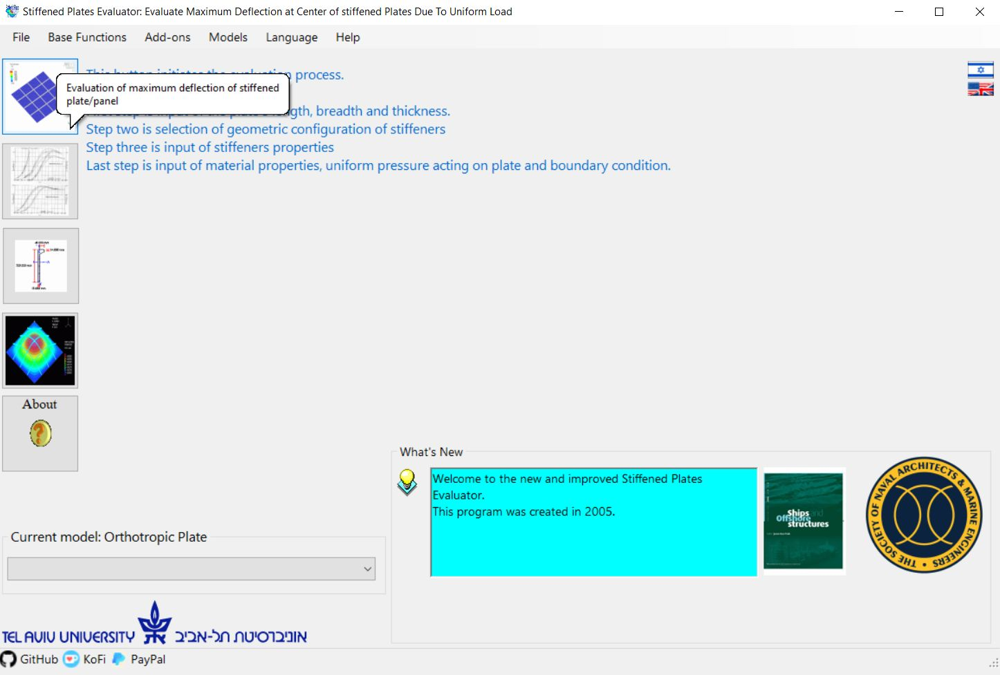

# SPE (Stiffened Plate Evaluator)</h1> 
 
 
<a href="https://github.com/LiorBanai/SPE/blob/master/LICENSE">
    

  

 This is my Tel Aviv University Mechanical Engineering Final Year Project (circa 2005).

Originally was created in Visual basic using .Net framework 1.1.
 
 Updated to .Net Framework 4.7 and .NET 6...
 

## History

### V2.1.0
- Updated to 2022

### V2.0.0
- This version is a 2006 version, post submission, which added additional Model (Grillage model) and English  langague
- this version is for reference only

### V1.8.0
- Version 1.8 was submitted on May 2005 (source code was lost).
